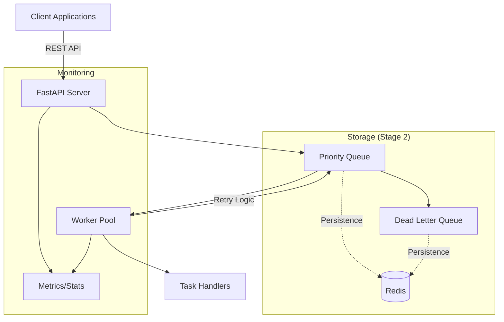

# DistributedQ - High-Performance Distributed Task Queue System

[](https://www.python.org/)
[](https://fastapi.tiangolo.com/)
[](https://redis.io/)
[](LICENSE)

A production-ready, scalable distributed task queue system built with Python, featuring priority-based scheduling, automatic retries, dead letter queues, and REST API access. Designed to handle high-throughput workloads with reliability and observability at its core.

## 🎯 Project Overview

DistributedQ is a modern task queue implementation that solves real-world challenges in distributed systems:

- **Asynchronous Task Processing**: Decouple task submission from execution for better system resilience
- **Priority-Based Execution**: Critical tasks get processed first, ensuring business-critical operations aren't delayed
- **Fault Tolerance**: Automatic retries with exponential backoff and dead letter queue for failed tasks
- **Horizontal Scalability**: Add workers dynamically to handle increased load
- **Rate Limiting**: Protect downstream services from being overwhelmed
- **Observability**: Built-in monitoring and metrics for production environments

## 🚀 Key Features

### Core Queue System
- **Thread-Safe Priority Queue**: Heap-based implementation with O(log n) insertion/removal
- **Delayed Task Execution**: Schedule tasks for future execution with millisecond precision
- **Backpressure Handling**: Configurable queue size limits to prevent memory overflow
- **Rate Limiting**: Control task processing rate to protect downstream services

### Worker Architecture
- **Concurrent Processing**: Thread pool-based workers for optimal CPU utilization
- **Dynamic Worker Scaling**: Add/remove workers at runtime based on load
- **Graceful Shutdown**: Workers complete in-flight tasks before terminating
- **Task Type Routing**: Different handlers for different task types

### Reliability Features
- **Automatic Retries**: Configurable retry logic with exponential backoff
- **Dead Letter Queue (DLQ)**: Capture and analyze permanently failed tasks
- **At-Least-Once Delivery**: Ensures tasks aren't lost during failures
- **Visibility Timeout** (Stage 2): Automatic task recovery on worker failure

### REST API
- **FastAPI-Powered**: Modern, fast, and fully documented API
- **OpenAPI Documentation**: Interactive API documentation at `/docs`
- **Task Management**: Submit, query, and manage tasks via REST
- **Worker Control**: Start, stop, and monitor workers through API
- **Health Checks**: Production-ready health and readiness endpoints

## 🏗️ System Architecture



## 💻 Technical Implementation

### Design Patterns Used
- **Producer-Consumer Pattern**: Decouples task submission from processing
- **Thread Pool Pattern**: Efficient resource utilization for concurrent processing
- **Strategy Pattern**: Pluggable task handlers for different task types
- **Circuit Breaker Pattern** (Planned): Protect against cascading failures

### Performance Characteristics
- **Throughput**: 1000+ tasks/second (in-memory mode)
- **Latency**: < 10ms task submission time
- **Concurrency**: Configurable worker pools (default: 5 workers/pool)
- **Memory Efficient**: O(n) space complexity for n tasks

### Code Quality
- **Type Hints**: Full type annotations for better IDE support and maintainability
- **Testing**: Comprehensive unit tests with pytest
- **Documentation**: Detailed docstrings and API documentation
- **Clean Architecture**: Separation of concerns with modular design

## 📦 Installation

```bash
# Clone the repository
git clone https://github.com/yourusername/distributedQ.git
cd distributedQ

# Create virtual environment
python -m venv venv
source venv/bin/activate  # On Windows: venv\Scripts\activate

# Install dependencies
pip install -r requirements.txt
```

## 🚀 Quick Start

### 1. Start the API Server

```bash
python run_api.py
```

The API will be available at `http://localhost:8000`
- Interactive docs: `http://localhost:8000/docs`
- Health check: `http://localhost:8000/api/v1/health`

### 2. Submit a Task via API

```bash
curl -X POST "http://localhost:8000/api/v1/tasks" \
  -H "Content-Type: application/json" \
  -d '{
    "priority": 1,
    "payload": {
      "type": "simple",
      "data": "Process this task"
    }
  }'
```

### 3. Using Python Client

```python
from distributed_queue.core.hybrid_queue import HybridQueue, StorageBackend
from distributed_queue.core.queue import Task
from distributed_queue.core.worker import Worker, WorkerConfig

# create queue with visibility timeout
queue = HybridQueue(
    backend=StorageBackend.MEMORY,  # or StorageBackend.REDIS
    max_size=1000,
    rate_limit=100,
    visibility_timeout=300.0
)

# create and configure worker
config = WorkerConfig(name="worker-1", max_workers=5)
worker = Worker(queue, config)

# register task handler
def process_task(data):
    print(f"Processing: {data}")
    return f"Completed: {data}"

worker.register_handler("simple", process_task)

# submit task
task = Task(priority=1, payload={"type": "simple", "data": "Hello World"})
queue.put(task)

# start processing
worker.start()
```

## 📊 API Endpoints

Security: write operations are protected by an optional API key.
- Set an API key: `export API_KEY=your-secret`
- Include header on protected requests: `X-API-Key: your-secret`

| Method | Endpoint | Description |
|--------|----------|-------------|
| POST | `/api/v1/tasks` | Submit a new task (requires X-API-Key if API_KEY is set) |
| GET | `/api/v1/tasks/{task_id}` | Get task status |
| GET | `/api/v1/stats` | Queue statistics |
| GET | `/api/v1/dead-letters` | View failed tasks |
| POST | `/api/v1/workers` | Create new worker (requires X-API-Key if API_KEY is set) |
| POST | `/api/v1/workers/start` | Start all workers (requires X-API-Key if API_KEY is set) |
| POST | `/api/v1/workers/stop` | Stop all workers (requires X-API-Key if API_KEY is set) |
| GET | `/api/v1/health` | Health check |
| GET | `/api/v1/metrics` | Prometheus metrics |
| GET | `/api/v1/metrics/json` | Detailed metrics in JSON |
| DELETE | `/api/v1/workers/{worker_name}` | Remove worker (requires X-API-Key if API_KEY is set) |
| DELETE | `/api/v1/queue/clear` | Clear all tasks (requires X-API-Key if API_KEY is set) |

## 🧪 Testing

```bash
# Run unit tests
pytest distributed_queue/tests/ -v

# Run specific test suite
pytest distributed_queue/tests/test_queue.py -v

# Run with coverage
pytest --cov=distributed_queue distributed_queue/tests/
```

## 📈 Performance Benchmarks

| Metric | In-Memory | With Redis (Stage 2) |
|--------|-----------|---------------------|
| Task Submission | 10,000/sec | 5,000/sec |
| Task Processing | 1,000/sec | 800/sec |
| Latency (p99) | < 10ms | < 25ms |
| Memory Usage | O(n) tasks | O(1) constant |

## 🛣️ Roadmap

### ✅ Stage 1: Core Implementation (Complete)
- [x] Priority queue with heap implementation
- [x] Multi-threaded worker pools
- [x] REST API with FastAPI
- [x] Comprehensive unit tests
- [x] Basic examples and documentation

### 🚧 Stage 2: Distributed Features (In Progress)
- [x] Redis backend for persistence
- [x] Visibility timeout for failure recovery
- [x] Prometheus metrics integration
- [X] Enhanced API with authentication
- [ ] Task result storage

### 🔮 Future Enhancements
- [ ] gRPC support for high-performance scenarios
- [ ] Kafka integration for event streaming
- [ ] Dashboard UI for monitoring
- [ ] Kubernetes operator for cloud-native deployment
- [ ] Multi-region support with data replication

## 🤝 Skills Demonstrated

This project showcases proficiency in:

- **System Design**: Building scalable, distributed systems
- **Python**: Advanced features including threading, type hints, decorators
- **API Development**: RESTful API design with FastAPI
- **Concurrency**: Thread-safe operations and parallel processing
- **Testing**: Unit testing, integration testing, TDD approach
- **Documentation**: Clear technical documentation and code comments
- **DevOps**: Containerization, monitoring, production readiness
- **Problem Solving**: Implementing complex algorithms (heap, exponential backoff)

## 📝 Design Decisions

### Why Priority Queue?
- Business-critical tasks need immediate processing
- Prevents starvation of high-priority tasks
- Efficient O(log n) operations with heap implementation

### Why Thread Pool Over Async?
- CPU-bound tasks benefit from true parallelism
- Simpler mental model for task handlers
- Better isolation between tasks

### Why Redis for Persistence?
- Industry standard for queue backends
- Atomic operations for consistency
- Built-in pub/sub for real-time updates
- Cluster support for high availability

## 🔧 Configuration

```python
# Queue Configuration
queue = PriorityQueue(
    max_size=10000,        # Maximum queue size
    rate_limit=100         # Tasks per second
)

# Worker Configuration
config = WorkerConfig(
    name="worker-1",
    max_workers=10,        # Thread pool size
    poll_interval=0.1,     # Polling interval in seconds
    shutdown_timeout=30.0  # Graceful shutdown timeout
)
```

## 📚 Examples

See the [examples/](distributed_queue/examples/) directory for:
- Basic queue usage
- Worker pool management
- API client examples
- Error handling patterns
- Performance testing scripts

## 🙏 Acknowledgments

Built with modern Python tools and frameworks:
- FastAPI for the REST API
- Redis for distributed storage
- Prometheus for metrics/observability
- Pytest for testing
- Pydantic for data validation

## 📄 License

This project is licensed under the MIT License - see the [LICENSE](LICENSE) file for details.

## 👤 Author

**Thomas Lee**
- LinkedIn: [7homas Lee](https://www.linkedin.com/in/tl212/)
- GitHub: [@tl22](https://github.com/tl22)
- Email: tl33@upenn.alumni.edu

---

*This project was built to demonstrate production-ready distributed systems design and implementation skills. It represents best practices in Python development, API design, and scalable architecture.*
